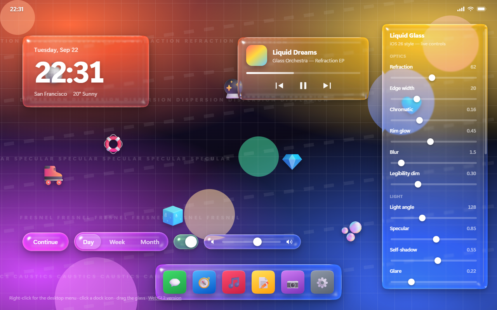
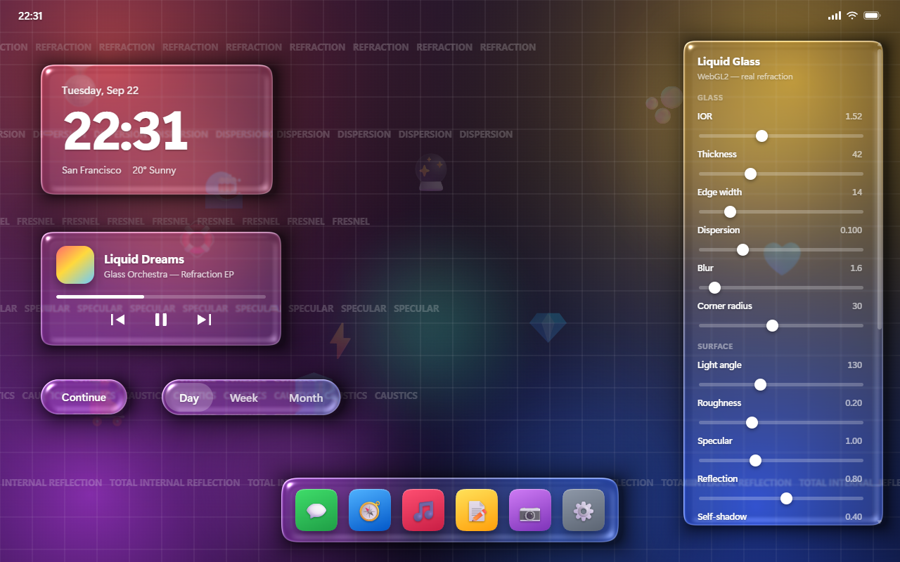

<div align="center">

# Liquid Glass

**The Liquid Glass material from iOS 26 / macOS 26, rebuilt in the browser two different ways: CSS with SVG filters, and a hand-written WebGL2 shader. No dependencies, no build step - open the file and it runs.**

[Open it in the browser](https://alexalesha.github.io/LiquidGlass/) &nbsp;·&nbsp; [Download for Windows](https://github.com/ALEXalesha/LiquidGlass/releases/latest) &nbsp;·&nbsp; [Русская версия этого файла](README.ru.md)

[](https://github.com/ALEXalesha/LiquidGlass/actions/workflows/ci.yml)
[](https://alexalesha.github.io/LiquidGlass/)
[](LICENSE)



</div>

> The control panels are in English; the detailed write-up is in Russian - [README.ru.md](README.ru.md), which this file summarises.

## What is here

| File | Technique | What it is good for |
| --- | --- | --- |
| `index.html` | CSS + SVG filters inside `backdrop-filter` | Works over ordinary DOM, nothing has to be rewritten |
| `webgl.html` | WebGL2, a hand-written fragment shader | Real refraction through `refract()`, spectral dispersion, environment reflection |
| `blender/glass_ref.py` | Cycles, honest path tracing | The reference to compare against: how glass actually behaves |
| `tests.html` | Drives both pages in hidden frames | 49 checks plus speed budgets |
| `invariants.html` | Properties instead of examples | 31 invariants, ~27 000 random cases per run |
| `bench.html` | Drags a panel in a visible frame and counts frames | What movement costs, and what the cost is made of |
| `electron/` | The same pages as a five-tab app | Installer and portable exe for Windows, no browser and no server |



## The idea

A plain `backdrop-filter: blur()` gives frosted glass. Apple's is different: nearly clear in the middle, with all the work happening at the rim - there the background is refracted, split into colour channels, and lit by a specular highlight.

To get that, each glass element builds a signed distance field of its own shape, turns it into an edge height profile, and bakes the profile into three textures: displacement (R and G shift the background sample, B carries the rim ring), specular, and self-shadow.

**Three textures, not four, and that is not cosmetic.** Every `toDataURL` call costs about 0.9 ms flat, whatever the image size. `feDisplacementMap` only reads R and G, so the blue channel was free, and the rim mask lives there - pulled back out with a single `feColorMatrix` that moves B into alpha.

Three details decide whether it reads as glass:

- **The edge profile is a circular arc**, `h(t) = sqrt(1 - (1 - t)^2)`, not a `smoothstep`. Its derivative goes to infinity right at the contour, so the background compresses sharply at the border and the distortion is gone a few pixels in. A `smoothstep` gives a soft symmetric bump - it looks like a highlight, not like glass.
- **The displacement scale is negative.** A convex rim works as a lens and pulls in what is *outside* the element. With a positive sign the background spreads outward and the thing looks like a soap bubble.
- **The highlight is computed, not drawn.** Blinn-Phong specular from the surface normal of the same height field, plus a Fresnel term at the edge and a second, dimmer fill from the opposite side. That is why it wraps around corners by itself and gives the characteristic double rim - bright above, muted below.

## Speed, measured rather than guessed

Numbers are for eight glass elements at dpr 1, the largest 210x806.

| | Before | After |
| --- | --- | --- |
| Baking every texture | 249 ms | 71 ms |
| Baking one large panel | 105 ms | 16 ms |
| Rebuilding the filter per slider tick | ~40 ms | 0.5 ms |
| Main thread blocked during a full re-bake (1440x880) | 299 ms | 0.4 ms |

What turned out to be expensive, in order: the lighting pass computed the flat interior of every element (74 ms of 105) - now each row remembers the span deeper than the bevel and fills it with one precomputed value; PNG encoding (76 ms of 108) barely depended on resolution, so the fix was fewer calls, not smaller images; and rebuilding the filter replaced the whole `<filter>` node, forcing Chrome to decode the `feImage` data URLs again.

**The bake then moved into a worker.** The pixel maths stays an ordinary function and the worker source is assembled with `String(fn)`, so there is exactly one copy of the code and the worker runs literally that. Two traps on the way: `clamp` and `byte` were arrow functions in `const`, and `String()` of one of those yields an anonymous expression the worker cannot call by name - they had to become declarations. And a worker that died left every element without maps forever, so `drainWaiting()` now finishes the job on the main thread.

## Checks

Three harnesses, all plain pages with no dependencies:

- **`tests.html` - 49 checks.** Every slider reaches the property it claims to control, toggles toggle what they say, the menu frees its filter nodes, hidden elements are not baked, pressing a button does not move its neighbours, a broken shader shows its log. Plus what state cannot show: dragging Light angle through 20 steps must queue at most three worker jobs per element and must still settle on the released value.
- **`invariants.html` - 31 properties, ~27 000 random cases.** Symmetry and bounds of `corner()`, sign and monotonicity of `sdf()`, that the hand-rolled `pow46`/`pow26` really equal `x^46` and `x^26`, that channels do not bleed into each other, that two bakes of one shape give identical bytes, that with light straight above the highlight is symmetric, and that refraction at opposite rims bends opposite ways. Then the state machines: after any sequence of actions the queue is empty, every visible element holds maps, no element is queued twice. It paid off immediately and twice - the first run found a queue peak of 1297 entries, and a second seed found `paints a displacement map it is not holding`, the same class of bug as one fixed earlier but reached from a different input.
- **`bench.html`** drags a panel in a *visible* frame under each configuration and counts frames, up to the ceiling of not using an SVG filter at all.

**Frame rates are reported as skipped, never invented.** A tab that is not compositing parks `requestAnimationFrame`, and any measurement would return zero. The same rule is why the full Electron self-check (`npm run selftest`, 49 + 31 checks in the real shell) is run locally with the window in front, while CI runs the 24 shell unit tests, which do not depend on a screen.

```bash
npm test          # 24 checks of the shell: routing, policy, tabs
npm run selftest  # the whole app: both harnesses plus the shell, needs a visible window
```

## Running it

Any static server, or just open the file:

```bash
python -m http.server 8123
```

Then `http://localhost:8123/index.html`. `file://` works too, but filters with data URLs are more reliable over HTTP - which is also why the desktop app serves the pages over its own `app://` scheme instead of `file://`: there every page would get its own opaque origin, and the harnesses have to reach into the frames they drive.

## The Windows app

The same five pages in one window with a tab bar, no browser and no server. Nothing leaves the machine: the content policy allows no network source at all, and the self-check verifies both that nothing was refused which the pages need and that no request left the machine.

| File | What it is |
| --- | --- |
| `LiquidGlass-<version>-setup.exe` | Installer, per user, no admin rights |
| `LiquidGlass-<version>-portable.exe` | One file, runs from anywhere |

## Screenshots are generated

`tools/make-screenshots.js` opens the pages in Electron - the same `app://` scheme through the same `electron/serve.js` the app uses - waits until the glass has baked its textures and WebGL has drawn its first frame, and captures the page itself with `capturePage()`. A screen grab would be wrong: a window that just opened can sit behind others, and then the shot catches someone else's content.

```bash
npx electron tools/make-screenshots.js
```

## Stack

Vanilla JavaScript · CSS `backdrop-filter` · SVG filters · WebGL2 · Web Workers · OffscreenCanvas · Electron · Blender Cycles (as the reference)

## Licence

MIT, see [LICENSE](LICENSE).
